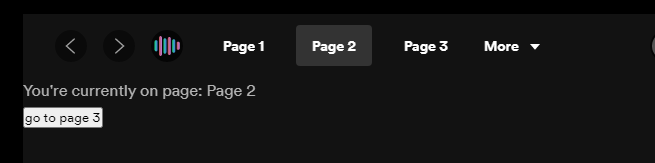

# Spicetify Creator - Navigation Bar Plugin
#### Supports custom apps
A Plugin for [Spicetify Creator](https://github.com/FlafyDev/spicetify-creator) to easily add a navigation bar to your custom app


## Getting Started
1. Create a [Spicetify Creator](https://github.com/FlafyDev/spicetify-creator) project
2. `yarn add spcr-navigation-bar`

## Preview
  
```ts
app.tsx

import React from 'react'
import useNavBar from 'spcr-navigation-bar';

const App = () => {
  const [NavBar, activeLink, setActiveLink] = useNavBar(["Page 1", "Page 2", "Page 3", "Page 4", "Page 5"]);

  return <>
    {NavBar}
  </>
}

export default App;
```
