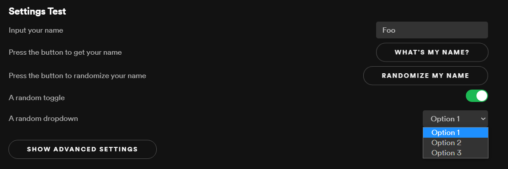

# Settings Plugin
#### Supports both extensions and custom apps
Easily add settings to your apps


## Getting Started
1. Create a [Spicetify Creator](https://github.com/FlafyDev/spicetify-creator) project
2. `yarn add spcr-settings`

## Preview

```tsx
import { SettingsSection } from "spcr-settings";

async function main() {
  const settings = new SettingsSection("Settings Test", "settings-test");

  settings.addInput("your-name", "Input your name", "Foo");

  settings.addButton("button-1", "Press the button to get your name", "What's my name?", () => {
    Spicetify.showNotification(settings.getFieldValue("your-name") as string);
  });

  settings.addButton("button-2", "Press the button to randomize your name", "Randomize my name", () => {
    settings.setFieldValue("your-name", (Math.random() + 1).toString(36).substring(2));
    settings.rerender();
  });

  settings.addToggle("random-toggle", "A random toggle", true);
  
  settings.addDropDown("random-dropdown", "A random dropdown", ['Option 1', 'Option 2', 'Option 3'], 2);

  settings.addHidden("last-page-visited", "Page 1"); // Settings without UI

  settings.pushSettings();
}

export default main;
```
